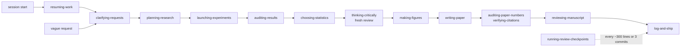

# Research skills for Claude Code

A set of [Claude Code](https://code.claude.com) skills, hooks and small tools that make Claude a more
reliable collaborator on research projects — computational neuroscience in particular (RNN modeling,
dynamical-systems analysis, electrophysiology, paper writing).

They exist to fix three recurring problems:

- **Inconsistency** — every project, every session re-invents its conventions (figure style, code
  style, how results are reported). Here the conventions are written once and shared.
- **Errors that look like answers** — a mean that hides the one seed that worked, a citation that
  does not say what it is cited for, a number in the draft that no script produced. Here they are
  checked by scripts and by an independent reviewer before they reach you.
- **Losing ownership of the project** — code generated faster than anyone reads it, and decisions
  drifting from the goal one reasonable step at a time. Here regular human review checkpoints keep
  you in the loop, and vague requests are turned into precise ones before work starts.

## Contents

1. [Five-minute start](#five-minute-start)
2. [How skills work](#how-skills-work)
3. [The skills](#the-skills)
4. [How they work together](#how-they-work-together)
5. [Installation](#installation)
6. [Configuration reference](#configuration-reference)
7. [Hooks: the rules that are enforced](#hooks-the-rules-that-are-enforced)
8. [Scripts](#scripts)
9. [Repository layout](#repository-layout)
10. [Maintaining and contributing](#maintaining-and-contributing)
11. [Troubleshooting](#troubleshooting)

## Five-minute start

```bash
claude plugin marketplace add kiriclope/claude-skills
claude plugin install research-core@leon-skills
pip install "git+https://github.com/kiriclope/claude-skills#subdirectory=python"   # colorblind palette
```

Then, in any Claude Code session:

- ask something vague — *"the figures need to be better"* — and Claude asks you a few sharp
  questions before doing anything (**clarifying-requests**);
- ask it to *"think critically"* about a result — a fresh, independent agent re-checks every claim
  against the data and the literature (**thinking-critically**);
- ask for a figure — it comes out colorblind-safe, checked for small fonts and overlapping labels,
  and looked at before it is reported (**making-figures**).

For the full setup (per-project configuration, your profile, the hooks), see [Installation](#installation).

## How skills work

A **skill** is a folder with a `SKILL.md` file: a short description of when to use it, followed by
instructions, sometimes with `scripts/` (deterministic checks) and `references/` (longer material).
Claude Code reads the description of every installed skill and loads a skill's instructions when
your request matches. You can use a skill in three ways:

| How | Example | Reliability |
|---|---|---|
| Type its name as a command | `/thinking-critically why do the wells sit above the line?` | always runs it |
| Use one of its trigger phrases | *"think critically"*, *"double-check"*, *"log and commit"* | very reliable |
| Just ask | *"log and commit"*, *"upload the figures"* | works for skills with clear trigger words |

Skills that hold **conventions** — how to write code, paper text, report a result — rarely load on
their own: Claude does not see "edit this script" as a moment to load a skill. Measured over 22
sessions, only 7 of 22 skills ever loaded unprompted, and the convention skills never did. The fix
is a short **"which skill when" table in your profile**, which is loaded in every session
([example](profiles/leon.md), and see [Write your profile](#write-your-profile)).

Installed as a plugin, skills appear with their plugin's prefix (for example `research-core:making-figures`).

Three layers keep the skills generic while still knowing your project:

1. **Skills** — procedures and default conventions, the same for everyone.
2. **`.claude/project.yaml`** in each project — the project's facts: where its docs and memory live,
   which commands run it, its color map, its coding rules, its review settings
   ([reference](#claudeprojectyaml)).
3. **Your profile** — `~/.claude/CLAUDE.md`, loaded in every session: who you are and how you like
   to work ([example](profiles/leon.md)).

Skills are advice that Claude follows. The few rules that must never be skipped are **hooks**,
enforced by Claude Code itself ([details](#hooks-the-rules-that-are-enforced)).

## The skills

Twenty-eight skills in three plugins. `research-core` is for any research project; `lowrank-rnn`
is specific to the low-rank RNN code base; `personal` holds one maintainer-only skill.

### Think and plan

| Skill | What it does | Use it when |
|---|---|---|
| [clarifying-requests](plugins/research-core/skills/clarifying-requests/SKILL.md) | Acts as your reflection partner: looks in the context first, mirrors back what you seem to want (and the deeper question behind it), asks at most four sharp questions with concrete options, then writes a five-line task spec. | A request is vague, or you say *"help me think this through"*. |
| [planning-research](plugins/research-core/skills/planning-research/SKILL.md) | Turns a question into a falsifiable hypothesis, predictions, controls, a success criterion fixed in advance and a staged run plan; re-plans honestly after results. | *"What should we try next?"*, *"design a sweep"*, before anything expensive. |
| [thinking-critically](plugins/research-core/skills/thinking-critically/SKILL.md) | Plan → act → a **fresh agent** (never shown Claude's reasoning) re-checks every claim against the evidence and the literature → revise with a calibrated confidence. Every claim is tagged *observed*, *derived*, *recalled* or *assumed*; unverified recall is where hallucinations hide. | *"Think critically"*, interpreting results, proposing mechanisms, literature claims. |

### Run experiments

| Skill | What it does | Use it when |
|---|---|---|
| [launching-experiments](plugins/research-core/skills/launching-experiments/SKILL.md) | Parameters confirmed before launch, a pilot run, one detached screen and one log per seed, concurrency caps, provenance (git hash, config, seed) in every run folder, verdicts and figures before reporting. | Launching, monitoring or resuming sweeps and long jobs. |
| [run-card](plugins/lowrank-rnn/skills/run-card/SKILL.md) | *(lowrank-rnn)* Answers "what exactly did we train?": per stage the loss terms, weights, targets and windows, optimizer, freezing — read from the training code itself, with other runs shown as differences grouped into arms. | *"What loss are we using?"*, before interpreting a sweep or writing Methods. |
| [debugging-training](plugins/research-core/skills/debugging-training/SKILL.md) | Systematic diagnosis: reproduce on one seed, read the loss curve's shape, NaN hooks, gradient norms, frozen parameters that actually move (weight decay does that), overfit one batch, bisect. | Training misbehaves or results changed after an edit. |

### Analyze

| Skill | What it does | Use it when |
|---|---|---|
| [auditing-results](plugins/research-core/skills/auditing-results/SKILL.md) | Unit by unit (seed, subject, session) instead of means; all outcomes, not only the visited one; effects in noise units; nulls; matched trial counts and normalizations; pseudoreplication; an honest finding / assumption / limitation split. | Numbers just came out, before any conclusion. |
| [choosing-statistics](plugins/research-core/skills/choosing-statistics/SKILL.md) | Chooses the test from the design before any result is seen — unit of replication, pairing, nesting (mixed model or GEE), exact small-n tests and the smallest p they can reach — then reports that test whatever it gives; no test shopping. | A comparison, p-value or star is about to be computed. |
| [checking-derivations](plugins/research-core/skills/checking-derivations/SKILL.md) | Derive with sympy, state assumptions, then check numerically against the real model (Jacobian vs autograd vs finite differences). | Deriving or editing an equation; a formula and a simulation disagree. |
| [flow-verdict](plugins/lowrank-rnn/skills/flow-verdict/SKILL.md) · [traj-verdict](plugins/lowrank-rnn/skills/traj-verdict/SKILL.md) · [bifurcation-probe](plugins/lowrank-rnn/skills/bifurcation-probe/SKILL.md) | *(lowrank-rnn)* Score flow fields, trajectories and fixed points of low-rank RNNs with the project's scripts instead of eyeballing figures, with the known misinterpretation traps listed. | Interpreting κ-plane flows, trajectories or bifurcations. |

### Figures and code

| Skill | What it does | Use it when |
|---|---|---|
| [making-figures](plugins/research-core/skills/making-figures/SKILL.md) | One house style for main and supplementary figures; **colorblind-safe** colors from `cbstyle` (never red vs green, never hue alone, fixed points coded by shape); real data rather than summary graphics; render → automatic check → look → fix; caption standard. | Before writing or editing any plotting code. |
| [writing-research-code](plugins/research-core/skills/writing-research-code/SKILL.md) | The coding conventions: names that follow the math, docstrings that say what a script decides and how to run it, one source of truth for every constant, per-unit printed results, verify by running. | Writing or editing code. |
| [reviewing-code-readability](plugins/research-core/skills/reviewing-code-readability/SKILL.md) | Checks code against those conventions (`readability_check.py`: hard-coded derived constants, comments that swallowed code, silent excepts, opaque names, …) plus a ten-point "colleague test"; fixes without changing behavior. | Before committing code, or *"is this readable?"*. |

### Write and publish

| Skill | What it does | Use it when |
|---|---|---|
| [writing-paper](plugins/research-core/skills/writing-paper/SKILL.md) | Claim-first manuscript prose in the journal's style; every panel cited; one vocabulary; every number from the numbers log; claims reviewed by a fresh agent before the draft is shared. | Drafting or revising paper text. |
| [auditing-paper-numbers](plugins/research-core/skills/auditing-paper-numbers/SKILL.md) | Every number in the draft matched to the current output of the numbers script: matched, mismatched, or unsourced. | Before sharing or submitting a draft. |
| [verifying-citations](plugins/research-core/skills/verifying-citations/SKILL.md) | Every reference checked against Crossref and OpenAlex (exists, title, first author, year, venue, DOI); each cited claim pinned to a quoted passage. | Adding or reviewing references. |
| [reviewing-literature](plugins/research-core/skills/reviewing-literature/SKILL.md) | A search protocol across Semantic Scholar, OpenAlex, PubMed, arXiv and bioRxiv; a "they show X, we add Y" comparison matrix; notes checkpointed to `docs/lit/`. | Related work, positioning, novelty. |
| [reviewing-manuscript](plugins/research-core/skills/reviewing-manuscript/SKILL.md) | A mock referee review: one fresh agent per lens (claims vs evidence, statistics and methods, novelty, clarity, reproducibility), each seeing only the text, the figures and the numbers; findings as must-fix / should-fix / judgment call, each checked before it is applied. | *"Act as a reviewer"*, before sharing or submitting. |
| [publishing-drafts](plugins/research-core/skills/publishing-drafts/SKILL.md) | Publishes drafts, figure pages and notes as claude.ai pages with their source and builder in the repo; reads the live page before republishing, keeps the same URL, and answers every reader comment. | Publishing or updating a page; at session start on a project with pages. |
| [responding-to-reviewers](plugins/research-core/skills/responding-to-reviewers/SKILL.md) | Point-by-point responses with full coverage, no fabricated results, no promises the revision does not keep. | Reviews or a decision letter arrive. |

### Keep the project in hand

| Skill | What it does | Use it when |
|---|---|---|
| [resuming-work](plugins/research-core/skills/resuming-work/SKILL.md) | Picks a project back up: what changed since a date, what is running, whether a review is due, the newest state in memory, open items; finds the past session that worked on something; flags bloated or duplicated memory. | Session start, *"where were we?"*, *"which session had X?"*. |
| [organizing-projects](plugins/research-core/skills/organizing-projects/SKILL.md) | Keeps the repository organized: every source in git (including hand-made vector art and builders), outputs out of it, no `_v2` / `_old` copies, scratch promoted or deleted, docs indexed, a lean CLAUDE.md. Proposes a tidy plan; nothing moves until you approve. | *"Organize"*, *"tidy up"*, lost or duplicated files. |
| [running-review-checkpoints](plugins/research-core/skills/running-review-checkpoints/SKILL.md) | Regular **human review**: after ~300 changed lines or 3 commits since your last review, a one-screen digest — intent, what changed and why, the decisions taken for you (approve or change each), drift, the hunks most worth reading. Enforced by hooks in projects that opt in; recorded only after you approve. | Automatic when due; also *"where are we?"*, *"catch me up"*. |
| [log-and-ship](plugins/research-core/skills/log-and-ship/SKILL.md) | Updates the right docs and the cross-session memory, then commits (and pushes only when asked). | *"Log and commit."* |
| [maintaining-memory](plugins/research-core/skills/maintaining-memory/SKILL.md) | Keeps the cross-session memory short and current: trims oversized notes to their current state and lasting rules, archives the full original (never deletes), and keeps notes from growing back into logs. | *"Trim the memory"*, a note flagged as oversized. |
| [maintaining-skills](plugins/research-core/skills/maintaining-skills/SKILL.md) | Creates, updates, reviews and lints the skills themselves. | Adding or fixing a skill; a correction that should become a rule. |

### Personal

[figure-gallery](plugins/personal/skills/figure-gallery/SKILL.md) publishes figures to the
maintainer's local browser gallery. It is machine-specific; colleagues can ignore it.

## How they work together

The skills hand work to each other, so a typical piece of research runs through several of them:



For example, *"look at the new sweep"* becomes a precise question (which arm, score or mechanism?),
the result is scored seed by seed against a criterion written beforehand, an independent agent tries
to break the conclusion, the figure is rendered in the house style and looked at, and the result is
logged and committed — with a human checkpoint along the way if a lot of code changed.

## Installation

### Colleagues: install the plugins

```bash
# 1. the skills
claude plugin marketplace add kiriclope/claude-skills
claude plugin install research-core@leon-skills
claude plugin install lowrank-rnn@leon-skills          # only for the low-rank RNN code base

# 2. the colorblind palette used by figure code and by making-figures
pip install "git+https://github.com/kiriclope/claude-skills#subdirectory=python"

# 3. a clone, for the templates, the profile example and the hooks
git clone https://github.com/kiriclope/claude-skills ~/claude-skills
```

A plugin install copies only the plugin folders, which is why `cbstyle` and the clone are separate
steps. Update later with `claude plugin marketplace update`.

### Set up a project

Copy the template into the project and fill in what applies (everything is optional):

```bash
mkdir -p <project>/.claude
cp ~/claude-skills/templates/project.yaml <project>/.claude/project.yaml
```

Without it the skills still work, with generic defaults.

### Write your profile

Your profile tells Claude who you are and how you like to work, in every project:

```bash
cp ~/claude-skills/profiles/leon.md ~/claude-skills/profiles/<you>.md     # then edit it
ln -s ~/claude-skills/profiles/<you>.md ~/.claude/CLAUDE.md
```

Keep its **"Which skill when"** table: one row per kind of task and the skill to load before
starting it. Without it, the convention skills (code, paper, results, figures) are mostly skipped.

### Install the hooks (recommended)

Add both entries to `~/.claude/settings.json` (merge with any `hooks` you already have):

```json
{
  "hooks": {
    "PreToolUse": [
      { "matcher": "Bash",
        "hooks": [ { "type": "command", "timeout": 10,
                     "command": "python3 ~/claude-skills/hooks/guard_bash.py" } ] }
    ],
    "Stop": [
      { "hooks": [ { "type": "command", "timeout": 30,
                     "command": "python3 ~/claude-skills/plugins/research-core/skills/running-review-checkpoints/scripts/review_status.py --hook stop" } ] }
    ]
  }
}
```

Run `/hooks` in Claude Code to check that they loaded. They need `python3` with PyYAML.

### Maintainer: live edits through symlinks

The maintainer links the skills instead of installing them, so an edit in the repo is live in every
session at once:

```bash
ln -s ~/claude-skills/plugins/research-core/skills/* ~/.claude/skills/
ln -s ~/claude-skills/plugins/lowrank-rnn/skills/<skill> <project>/.claude/skills/<skill>
pip install -e ~/claude-skills/python
```

### Optional: keep the memory in a private git vault (Obsidian)

Claude Code's memory (`~/.claude/projects/<project>/memory/*.md`) is plain Markdown with `[[name]]`
links. Versioned in git, it gets a history and can be read and edited in Obsidian on another machine:

```bash
cd ~/.claude/projects && git init -b main
printf '*\n!*/\n!*/memory/\n!*/memory/*.md\n!*/memory/archive/\n!*/memory/archive/*.md\n!.gitignore\n!README.md\n' > .gitignore   # memory notes only, never transcripts
cat > .git/hooks/pre-commit <<'HOOK'
#!/bin/sh
python3 ~/claude-skills/plugins/research-core/skills/resuming-work/scripts/memory_links.py --root "$(git rev-parse --show-toplevel)" --add-aliases --quiet >/dev/null || exit 0
git add -- '*/memory/*.md'
HOOK
chmod +x .git/hooks/pre-commit
git add .gitignore '*/memory/*.md' && git commit -m "memory: baseline"
git remote add origin <a PRIVATE repository> && git push -u origin main
```
- **Private remote only**: memory holds unpublished results, even when the projects are public.
- The hook adds an `aliases:` line to each note so Obsidian resolves `[[name]]` links (Claude Code
  links by the `name:` slug, Obsidian by file name), and stages every changed note.
- On the other machine: clone it and *Open folder as vault*. Hooks are not cloned, so a note made
  there gets its aliases at the next commit on the server.
- log-and-ship commits memory changes to the vault when it exists; pushing waits for your request,
  as in any repository. Pull before a session if you edited notes elsewhere.

## Configuration reference

### `.claude/project.yaml`

Every key is optional. Read by the skill(s) in the second column.

| Key | Used by | Meaning |
|---|---|---|
| `name` | all | short project name |
| `memory_dir`, `memory_state_file` | log-and-ship | the project's Claude Code memory folder, and the file holding its live status |
| `docs_map` | log-and-ship | which doc to update for which kind of work (first match wins) |
| `never_stage` | log-and-ship | paths never committed unless you name them (e.g. `results/`) |
| `python`, `env_prefix` | most | the interpreter, and a prefix every command needs (e.g. an `LD_PRELOAD` shim) |
| `vocabulary` | writing-paper, making-figures | the paper's terms, e.g. `{memory axis: SAMPLE axis}` |
| `figure_style`, `figure_docs`, `figure_code` | making-figures | the style file, the docs to read first, the plotting helpers to reuse |
| `colors` | making-figures | the condition → color map (colorblind-safe, from `cbstyle`) |
| `paper_dir`, `style_guide` | writing-paper | where the manuscript is, the journal style guide |
| `numbers_script`, `numbers_log` | auditing-paper-numbers | the script that prints every number in the paper, and the file it writes (what the audit reads) |
| `review_figures`, `journal`, `field` | reviewing-manuscript | the canonical figure renders the reviewers get, and the venue and field for their brief |
| `stats` | choosing-statistics | sidedness, correction, alpha and permutation draws, declared before any result |
| `resume` | resuming-work | how far back the brief looks; the size above which a memory file is flagged |
| `organize` | organizing-projects | output and scratch folders, large-file and scratch-age limits, CLAUDE.md length |
| `pages` | publishing-drafts | every published page with its URL, source, builder and inputs |
| `launch`, `running_doc`, `verdict_scripts`, `plot_entrypoint` | launching-experiments, the guard hook | the sweep entry points (`launch.entrypoints`, which the guard refuses to run in the foreground), concurrency limits, seeds, scoring and plotting commands |
| `code_rules` | reviewing-code-readability | the project's own coding rules, one sentence each |
| `code_check` | reviewing-code-readability | settings of `readability_check.py`: line length, constants that must be derived and where, files allowed to hold colors |
| `review_checkpoint` | running-review-checkpoints | opt-in: `max_lines`, `max_commits`, which file types count, which paths do not |
| `gallery_project`, `figures_root` | figure-gallery | maintainer-only |

The [template](templates/project.yaml) lists every key with a comment.

### Review checkpoints: on and off

Checkpoints are **off** in a project until it has a `review_checkpoint:` block, and **on** in every
project that has one. You can switch them yourself — say *"turn review checkpoints off here"*, or:

```bash
python <skill>/scripts/review_status.py --off              # this project (local, not committed)
python <skill>/scripts/review_status.py --off --global     # every project
python <skill>/scripts/review_status.py --on [--global]    # back on
python <skill>/scripts/review_status.py --defer            # "not now": the next checkpoint comes one step later
python <skill>/scripts/review_status.py --reset            # fresh start; logged as NOT reviewed
```

## Hooks: the rules that are enforced

Skills are advice; these rules are enforced by Claude Code whatever the session does.

| Hook | Situation | Decision |
|---|---|---|
| `guard_bash.py` (before every shell command) | `git push` | asks you every time — **every project** |
| | a commit message without the `Co-Authored-By:` trailer | refused — **every project** |
| | the project's training launcher run in the foreground | refused — run it in `screen -dmS`, `tmux -d`, a scheduler (`sbatch`, `qsub`), `nohup … &` or the launcher's `--per_run_screen` mode. Launchers come from `launch.entrypoints` in `project.yaml` (default `sweep.py`, `rerun_dual.py`) |
| | a commit while a review checkpoint is due | refused until the checkpoint is done — **opted-in projects only** |
| `review_status.py --hook stop` (end of every turn) | a review checkpoint is due | Claude runs the checkpoint before ending the turn (never twice in a row) — **opted-in projects only** |

The guard matches commands, never text: a commit message or a heredoc that mentions `git push` or a
launcher does not trigger it. Details: [hooks/README.md](hooks/README.md).

## Scripts

The mechanical steps are scripts, so they give the same answer every time. Each has a self-test:
`python <script> --demo`.

| Script | Skill | What it checks or does |
|---|---|---|
| `review_status.py` | running-review-checkpoints | changed lines and commits since your last review; records reviews; the Stop hook |
| `readability_check.py` | reviewing-code-readability | hard-coded derived constants, swallowed code, silent excepts, opaque names, missing docstring or Usage, hex colors, nesting, long lines |
| `check_figure.py` | making-figures | fonts too small at print size, stray bold, overlapping or clipped text, colors a colorblind reader cannot separate |
| `cb_style.py` → `cbstyle` | making-figures | the colorblind-safe palette, shape-coded fixed-point markers, color-vision simulation |
| `audit_table.py` | auditing-results | per-unit tables, flat columns (a normalization that removed the effect), matched-n resampling |
| `check_jacobian.py` | checking-derivations | an analytic Jacobian against autograd and finite differences |
| `record_provenance.py` | launching-experiments | git hash, uncommitted changes, command, host, GPU and versions into each run folder |
| `freeze_check.py` | debugging-training | parameter checksums before and after a step, gradient-norm tables |
| `audit_numbers.py` | auditing-paper-numbers | numbers in a manuscript against the numbers log |
| `verify_refs.py` | verifying-citations | references against Crossref and OpenAlex |
| `stats_floor.py` | choosing-statistics | the smallest p a sign test, Wilcoxon, Mann-Whitney or permutation test can reach at a given n |
| `materials.py` | reviewing-manuscript | gathers the text, canonical figures and numbers log the reviewer agents receive |
| `resume_brief.py` | resuming-work | the catch-up brief: git, running jobs, review status, newest memory state, open items |
| `memory_links.py` | resuming-work | Obsidian `aliases:` for memory notes, and the `[[links]]` that resolve nowhere |
| `memory_trim.py` | maintaining-memory | oversized notes; snapshot; checks a trimmed draft (front matter, numbers, scripts it no longer describes); archives and applies |
| `project_audit.py` | organizing-projects | untracked or ignored sources, version-suffixed copies, large files, stale scratch, unindexed docs |
| `pages_check.py` | publishing-drafts | every page in `pages:` has its source and builder in the repo and is up to date |
| `run_card.py` | run-card | per-stage training settings of a sweep, read from the training code |
| `lint_skills.py` | maintaining-skills | the skills themselves: format, length, personal facts in shared skills, drifted copies |
| `guard_bash.py` | (hook) | the enforced rules above |

## Repository layout

```
.claude-plugin/marketplace.json   the marketplace "leon-skills"
plugins/
  research-core/                  general skills, any research project
    skills/<skill>/SKILL.md       instructions, plus scripts/ and references/ where needed
  lowrank-rnn/                    skills for the low-rank RNN code base
  personal/                       maintainer-only (figure-gallery)
python/cbstyle/                   the colorblind palette package (pip install)
hooks/                            guard_bash.py and its README
templates/project.yaml            per-project configuration template
profiles/<person>.md              personal profiles (linked as ~/.claude/CLAUDE.md)
personal_patterns.txt             names and paths that must never appear in shared skills
CHANGELOG.md                      what changed, version by version
```

## Maintaining and contributing

Changes to skills go through the **maintaining-skills** skill — ask Claude to *"add a skill that …"*
or *"update the making-figures skill"*. The rules:

- **Shared skills hold no personal facts** — no names, home paths or machine details; those go in
  your profile or `project.yaml`. Add your own patterns to `personal_patterns.txt`; the linter checks.
- A skill's description says **what it does and when to use it**; the body stays under 500 lines,
  with detail in `references/`; anything mechanical becomes a script with a `--demo` self-test.
- Before writing a skill, collect a few real failures it should prevent, and test it on them with
  a fresh agent.
- Behavior is tested with evals: `plugins/research-core/evals/<case>/` holds a prompt and graders,
  some checking that the right skill fired. Run them with
  `claude plugin eval plugins/research-core --no-publish` (each run costs a few cents; `--case` picks one).
- After a change: lint, validate, bump the plugin's `version` in `.claude-plugin/plugin.json` (that
  is what makes `claude plugin marketplace update` pick it up), and add a line to the CHANGELOG.

```bash
python plugins/research-core/skills/maintaining-skills/scripts/lint_skills.py --projects <project roots>
claude plugin validate .
for s in $(find plugins -path "*/scripts/*.py"); do python "$s" --demo >/dev/null && echo "ok  $s" || echo "FAIL $s"; done
```

## Troubleshooting

**A skill does not trigger.** Call it by name (`/thinking-critically …`) or use its trigger phrase;
type `/` to see the installed skills. For skills that should load on their own, add a row to the
"which skill when" table in your profile.

**The guard refuses a command.** It refuses your project's training launcher run in the foreground:
run it in `screen -dmS`, `tmux -d`, a scheduler (`sbatch`, `qsub`), `nohup … &`, or with
`--per_run_screen`. Launcher names come from `launch.entrypoints` in `project.yaml`. Text that only
mentions a launcher or `git push` — a commit message, a heredoc, a `grep` pattern — is ignored.

**"Review checkpoint due" refuses a commit.** That is the commit gate: run the checkpoint (say
*"review checkpoint"*), or postpone it with `review_status.py --defer`, or switch it off with `--off`.

**`ModuleNotFoundError: cbstyle`.** Run the `pip install` line from [Installation](#installation) in
the environment that runs your figure scripts.

**A watermark or provenance plugin flags a `SKILL.md` and offers to "clean" it.** Do not: such
cleaners delete the `description:` line, and a skill without its description never triggers.

**The hooks do nothing.** Check `/hooks` in Claude Code, that `python3` can import `yaml`, and — for
checkpoints — that the project's `.claude/project.yaml` has a `review_checkpoint:` block.
